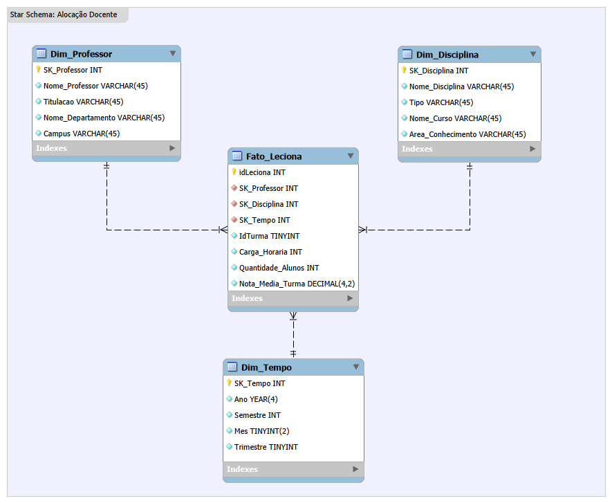

# Projeto: Modelagem Dimensional - Star Schema Universitário

## 🏗️ Estrutura do Modelo
 **Star Schema**:

* **Tabela Fato (`Fato_Leciona`):** Contém carga horária e chaves para as dimensões.
* **Dimensão Professor:** Dados sobre os docentes e seus departamentos.
* **Dimensão Disciplina:** Informações sobre as matérias, cursos e áreas de conhecimento.
* **Dimensão Tempo:** Ano, Semestre e Mês.

## 🛠️ Tecnologias Utilizadas
* MySQL Workbench (Modelagem Visual)

### 📊 Modelo Star Schema Final

Aqui está a representação visual do modelo dimensional desenvolvido:

